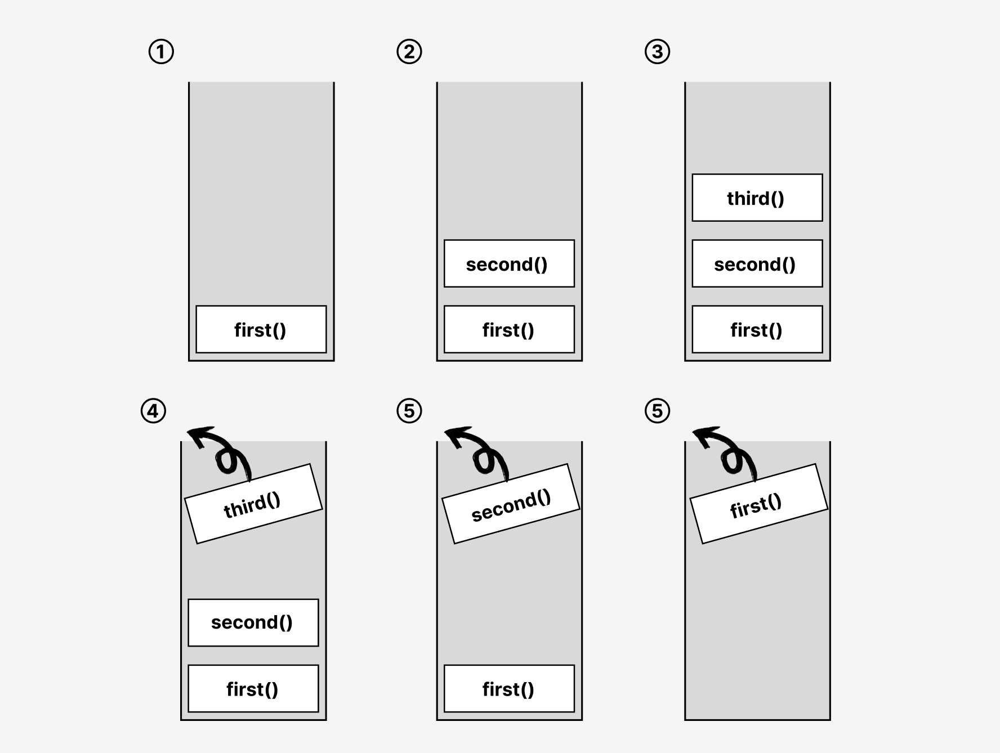
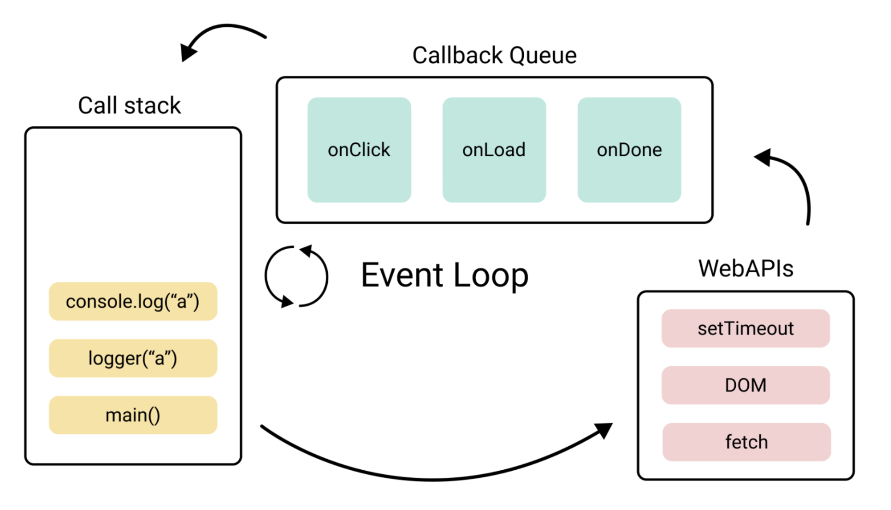
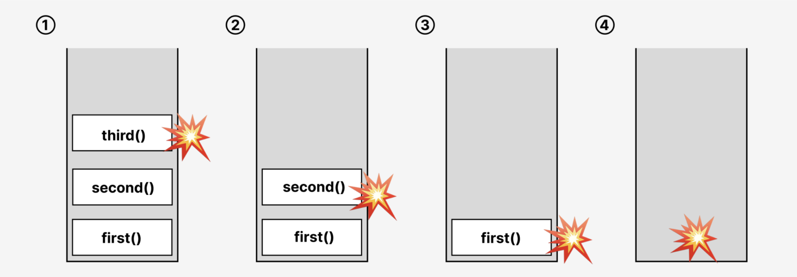
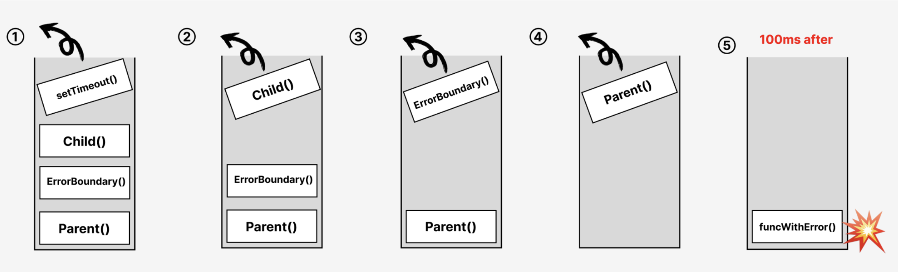

# 에러 바운더리가 비동기 에러를 잡지 못하는 이유

## 목차

1. 서론

- 1.1 대상 독자
- 1.2 주제 선정 배경

2. 이론적 배경

- 2.1 실행 컨텍스트와 콜스택
- 2.2 비동기 작업 처리 방식
- 2.3 동기 에러 전파 흐름
- 2.4 에러 바운더리(Error Boundary)의 에러 감지 방식

3. 에러 바운더리가 비동기 에러를 잡지 못하는 이유

4. 에러 바운더리가 비동기 에러를 잡게 하는 방법

## 1. 서론

### 1.1 예상 독자

이 글은 자바스크립트의 이벤트 루프, 리액트, 그리고 에러 핸들링에 대한 기본적인 이해도가 있어야 글을 이해할 수 있습니다. 자바스크립트의 이벤트 루프와 에러 바운더리의 동작에 대해 깊이 있게 이해하고자 하는 분들을 대상으로 합니다. 특히, 에러 바운더리를 실제로 사용하는 과정에서 어려움을 직접 겪어보신 분이라면 큰 도움이 될 것이라 생각합니다.

### 1.2 주제 선정 배경

현대 웹 개발에서 리액트는 대중적인 프론트엔드 라이브러리로 자리 잡았습니다. 리액트가 각광받는 이유 중 하나는 선언적인 형태로 코드를 작성할 수 있다는 점에 있습니다. 이전에는 UI를 그리는 과정을 절차지향적으로 일일이 나열해야 했다면, 리액트를 사용하면서부터는 한눈에 알아보기 좋은 선언적인 코드를 쉽게 작성할 수 있게 되었습니다.

웹 애플리케이션을 구현하는 과정에서 중요한 한 가지는 에러 처리입니다. 도메인과 상관없이 안정적인 사용자 경험을 제공하기 위해서는 에러 처리를 잘 해주는 것이 중요합니다. 그런데, 에러 처리를 꼼꼼히 해주는 과정에서 코드의 복잡도가 크게 증가하는 경우가 많습니다. UI 및 도메인 로직과 에러 처리 로직이 혼재하면서 책임의 경계가 모호해지는 경우가 발생하기 때문입니다. 그런데 리액트 16 버전부터는 에러 처리를 선언적으로 처리할 수 있도록 하는 기능이 추가되었습니다. 그 기능이 바로 에러 바운더리입니다. 클래스형 컴포넌트의 `static getDerivedStateFromError()` 와 `componentDidCatch()` 메서드를 이용하여 에러 바운더리를 구현할 수 있게 되었습니다. 에러 바운더리를 적용하게 되면 UI 및 도메인 로직과 에러 처리 로직의 관심사를 명확히 분리할 수 있습니다. 더불어 에러 처리 방식이 명시적이고 일관되기 때문에 예외에 대한 처리 방법이 코드에 잘 드러납니다.

하지만, 에러 바운더리를 사용하는 과정에서 에러가 예상대로 잡히지 않아 당황하게 되는 경우가 빈번하게 발생하곤 합니다. 이런 경우는 대체로 비동기적으로 발생한 에러를 잡으려고 하는 경우입니다. 자바스크립트의 비동기 함수 실행 방식을 고려하면 에러 바운더리로 비동기 에러가 잡히지 않는 것이 당연합니다. 하지만 프로젝트의 마감기한을 지키기 위해 코드를 서둘러 작성하는 동안에는 이러한 동작 방식을 깊이 고민할 시간이 없어 주먹구구식으로 대처하고 넘어가는 경우가 많습니다. 이 글을 통해 자바스크립트의 동작 방식을 간단히 살펴보고, 에러 바운더리가 비동기 에러를 잡지 못했던 이유에 대해 명확히 이해하고자 합니다.

## 2. 이론적 배경

### 2.1 실행 컨텍스트와 콜 스택

먼저 실행 컨텍스트와 콜 스택에 대한 이해를 바탕으로 자바스크립트에서 함수가 어떤 흐름으로 실행되는지 이해해야 합니다. 먼저 실행 컨텍스트와 콜 스택의 개념에 대해서 간략히 살펴 봅시다.

실행 컨텍스트는 간단히 말하자면 실행할 코드에 제공할 환경 정보들을 모아놓은 객체입니다. 코드를 실행하는 과정에서 변수, 함수, 클래스 이름 등 여러 식별자의 정보를 참조해야 하는데요. 이를 위해 실행 컨텍스트를 만들어 두고 필요한 정보들을 저장하고 꺼내어 쓴다고 생각하시면 좋을 것 같습니다. 실행 컨텍스트는 내부에 여러 가지 구성 요소를 포함하고 있어 상당히 복잡하지만, 현재의 맥락에서는 코드를 실행하기 위한 정보를 모아 놓은 곳 정도로만 이해해도 충분합니다.

콜 스택은 함수의 실행 컨텍스트가 쌓이는 스택 형태의 자료구조입니다. 자바스크립트 엔진은 콜 스택과 콜 스택에 쌓인 실행 컨텍스트를 통해 함수의 실행 흐름을 추적하고 관리합니다.

코드 실행 흐름 단계를 설명하면 다음과 같습니다.

1. 함수 호출: 함수가 호출되면 해당 함수의 실행 컨텍스트가 생성되고 콜 스택에 추가(push)됩니다.
2. 코드 실행: 콜 스택의 맨 위에 있는 실행 컨텍스트의 코드가 실행됩니다. 만약 실행된 함수 내에 또 다른 함수 호출이 존재한다면 1, 2의 과정을 반복합니다.
3. 함수 종료: 함수 실행이 완료되면 해당 실행 컨텍스트는 콜 스택에서 제거(pop)됩니다.
4. 상위 함수로 복귀: 콜 스택 상 아래에 위치한, 상위 함수의 실행으로 돌아갑니다.

역시 글로만 살펴 보니 이해가 잘 되지 않는데요. 실제 코드 예시와 그림을 살펴보며 더 구체적으로 이해해 봅시다.

**예시 코드**

```js
function first() {
  second();
}

function second() {
  third();
}

function third() {
  console.log("Hello World");
}

first();
```

이 예시 코드의 실행 흐름을 콜 스택 관점에서 살펴보면 다음과 같습니다.


  
1. ```first()``` 호출: ```first()```가 호출되어 ```first()```의 실행 컨텍스트가 콜 스택에 추가됩니다.
2. ```second()``` 호출: ```first()``` 내부에서 ```second()```가 호출되어 ```second()```의 실행 컨텍스트가 콜 스택 내 ```first()``` 실행 컨텍스트 위로 쌓입니다.
3. ```third()``` 호출: ```second()``` 내부에서 ```third()```가 호출되어 ```third()```의 실행 컨텍스트가 ```second()```의 실행 컨텍스트 위로 쌓입니다.
4. ```third()``` 종료: ```third()``` 내부 ```console.log()```가 실행된 후, ```third()```의 실행 컨텍스트가 콜 스택에서 제거됩니다.
5. ```second()``` 종료: 상위 함수인 ```second()```로 이동합니다. ```second()```의 실행이 종료되었으므로 ```second()```의 실행 컨텍스트가 콜 스택에서 제거됩니다.
6. ```first()``` 종료: 상위 함수인 ```first()```로 이동합니다. ```first()```의 실행이 종료되었으므로 ```first()```의 실행 컨텍스트가 콜 스택에서 제거됩니다.

### 2.2 비동기 작업 처리 방식

자바스크립트는 싱글 스레드 언어입니다. 즉, 자바스크립트를 실행하는 엔진은 싱글 메인 스레드를 가지고 한 번에 하나의 작업만을 처리할 수 있습니다. 하지만 실질적으로 따져보면 정말 한 번에 하나의 작업만 수행할 수 있는 건 아닙니다. 예를 들면, `fetch()`를 통해 웹 요청을 보낼 때 응답이 올 때까지 다른 일을 수행할 수 있습니다. 웹 요청을 보내는 동안 `setTimeout()`을 통해 타이머를 설정해둘 수도 있습니다. 싱글 스레드인 엔진이 이 모든 것을 어떻게 한 번에 처리하는 것일까요?


  
사실 자바스크립트 엔진의 메인 스레드는 브라우저의 런타임 환경(Web API, 이벤트 루프)과 협력하여 작업을 처리합니다. 메인 스레드가 ```fetch()```나 ```setTimeout()```과 같은 비동기 함수를 실행하면, 해당 작업은 브라우저의 Web API에 의해 백그라운드 스레드에서 처리됩니다.Web API가 작업을 모두 처리하고 나면 등록된 콜백 함수가 콜백 큐에 추가됩니다. 그 후 콜 스택이 비어 있게 되면, 약속된 순서에 따라 콜백 큐에 있는 콜백 함수들이 이벤트 루프에 의해 콜 스택으로 이동됩니다. 여기서 여러분이 기억하실 부분은 콜백 큐의 함수들은 콜 스택이 비어 있을 때야 비로소 실행된다는 점입니다.

### 2.3 동기 에러 전파 흐름

에러가 발생하면 현재 실행 컨텍스트가 콜 스택에서 제거되며 에러는 상위 호출자로 전파됩니다. 더 구체적으로 이야기하면, 에러가 발생한 실행 컨텍스트에서 출발하여 상위 실행 컨텍스트로 전파됩니다. 상위 실행 컨텍스트에서도 에러가 잡히지 않으면 계속해서 상위로 전파됩니다. 그러다가 최상위 실행 컨텍스트인 글로벌 실행 컨텍스트에서도 에러가 잡히지 않으면 크래시가 발생합니다. 즉, 해당 에러는 Uncaught Error로 간주되며 스크립트 실행이 중단됩니다.

실제 코드 예시를 살펴봅시다.

```js
function first() {
  console.log("App is starting...");

  second();
}

function second() {
  third();
}

function third() {
  throw new Error("Something went terribly wrong!");
}

first();

console.log("This line will never be executed");
```

위 스크립트의 실행 결과는 아래와 같습니다.

```
App is starting...
Uncaught Error: Something went terribly wrong!
```

`first()`에서 발생한 에러가 상위 컨텍스트인 `second()`, `third()`로 전파되었고, 최상위에서도 에러가 잡히지 않아 앱이 중단되었습니다.


  
### 에러 바운더리의 에러 감지 방식

컴포넌트에서 발생하는 에러도 당연히 일반적인 에러의 전파 흐름과 동일합니다. 자식 컴포넌트에서 발생한 에러는 부모 컴포넌트로 전파됩니다. 그리고 부모 컴포넌트에서도 처리되지 않는다면, 부모의 부모 컴포넌트로 전파되고 최상위 컴포넌트에서도 처리되지 않는다면 크래시가 발생합니다.

에러 바운더리는 하위 컴포넌트에서 전파된 에러를 잡아냅니다. try catch 문을 이용하여 하위 실행 컨텍스트에서 발생한 에러를 잡아내는 것과 유사합니다.


  
## 3. 에러 바운더리가 비동기 에러를 잡지 못하는 이유

앞선 내용에 대한 이해를 바탕으로 에러 바운더리가 비동기 에러를 잡지 못하는 이유를 실제 코드와 함께 살펴 보겠습니다.

```js
function Child() {
  const funcWithError = () => {
    throw new Error("error occurs!");
  };

  setTimeout(funcWithError, 100);

  return <div>I am child</div>;
}

function Parent() {
  return (
    <ErrorBoundary>
      <Child />
    </ErrorBoundary>
  );
}
```

Child라는 자식 컴포넌트에서 비동기적으로 에러를 발생시키고 있습니다. Parent는 자식 컴포넌트인 Child를 ErrorBoundary로 감싸고 있습니다.

결과적으로 Child를 감싸고 있는 ErrorBoundary는 Child에서 비동기적으로 발생하는 에러를 잡아내지 못합니다. 그 이유는 콜백 큐에 등록된 `funcWithError()`이 실행되는 시점에 ErrorBoundary의 실행 컨텍스트가 이미 제거된 이후이기 때문입니다.



## 4. 에러 바운더리가 비동기 에러를 잡게 하는 방법

비동기 에러를 잡을 수 있도록 만들려면 어떻게 해야 할까요?

사실 아쉽게도 에러 바운더리가 비동기 에러를 감지할 수 있게 하는 방법은 없습니다. 자바스크립트 엔진이 동작하는 방식을 고칠 수는 없기 때문입니다. 에러 바운더리가 비동기적으로 발생한 에러를 잡게 하는 유일한 방법은 비동기 에러를 동기적인 에러로 다시 던져주는 것뿐입니다. 그리고 이 방법은 생각보다 간단하게 구현이 가능합니다.

```js
function Child() {
  const [error, setError] = useState(null);

  const funcWithError = () => {
    try {
      throw new Error("something terrible happens!");
    } catch (error) {
      setError(error);
    }
  };

  setTimeout(funcWithError, 100);

  if (error) {
    throw new Error("error occurs!!");
  }

  return <div>I am child</div>;
}
```

비동기적으로 에러를 일으키는 로직을 try catch 문으로 감싼 후, catch 절에서 setState를 이용해 에러 state를 업데이트합니다. 그 후 컴포넌트 return 문 이전에 error 유무를 판단하여 동기적으로 에러를 던집니다. 이런 방식을 통해서 비동기적으로 발생한 에러를 동기적으로 다시 던져줄 수 있습니다.

## 참고 문헌

ErrorBoundary 가 포착할 수 없는 에러와 그 이론적 원리 분석: https://happysisyphe.tistory.com/66  
이벤트 루프와 매크로태스크, 마이크로태스크: https://ko.javascript.info/event-loop  
Event Loop: https://wikidocs.net/251900
